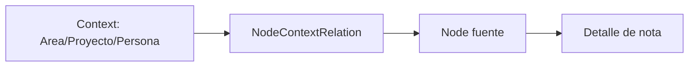

# VIN-007 - Revision del modelo de recuperacion

## Resumen ejecutivo

Vinema ya cumple una parte importante del paradigma rector: permite capturar
notas e ideas sin elegir una carpeta, preserva la fuente original y modela
relaciones independientes entre notas y contextos. Sin embargo, el producto
todavia no cumple la prioridad inmediata del roadmap: busqueda textual confiable
y recuperacion desde pistas incompletas.

La implementacion actual se apoya en `Context` como entidad separada con tipos
cerrados (`AREA`, `PROJECT`, `PERSON`). Esto es reutilizable como base de
relaciones, pero puede volverse contradictorio si la siguiente fase sigue
ampliando tipos de contexto antes de construir recuperacion por texto,
fragmentos, tiempo y explicacion de resultados.

Recomendacion: no reescribir el modelo todavia. Mantener temporalmente `Node`,
`Context` y `NodeContextRelation`, reinterpretar `Context` como punto de entrada
conceptual y dedicar el siguiente paquete a busqueda local confiable sobre
`Node.title` y `Node.content`, con resultados explicables y fuente visible.

## Inventario actual

### Modelo de dominio

#### Node

Archivo: `src/domain/node/node.ts`

`Node` es la unidad real de captura y fuente original. Campos:

- `id`
- `workspaceId`
- `type`: `NOTE` o `IDEA`
- `title`
- `content`
- `status`: `ACTIVE` o `ARCHIVED`
- `organizationStatus`: `INBOX` o `ORGANIZED`
- `metadata`
- `version`
- `createdAt`
- `updatedAt`
- `deletedAt`
- `createdByDeviceId`
- `lastModifiedByDeviceId`

Supuestos incorporados:

- una idea puede convertirse en nota sin duplicar el registro;
- una nota no almacena ids contextuales;
- archivo es estado, no ubicacion;
- Inbox deriva de `organizationStatus`;
- no hay eliminacion definitiva implementada.

Clasificacion: REUTILIZABLE.

#### ContextType

Archivo: `src/domain/context/context.ts`

Enum cerrado:

- `AREA`
- `PROJECT`
- `PERSON`

Supuestos incorporados:

- las perspectivas iniciales de VIN-000 se materializaron parcialmente como
  tipos de contexto;
- no existen contextos personalizados;
- Diario, Ideas y Archivo no son contextos.

Clasificacion: ADAPTABLE.

#### Context

Archivo: `src/domain/context/context.ts`

Campos:

- `id`
- `workspaceId`
- `type`
- `name`
- `description`
- `createdAt`
- `updatedAt`
- `archivedAt`

Restricciones en casos de uso:

- nombre requerido y con trim;
- tipo valido;
- `workspaceId` requerido;
- largo maximo de nombre: 120;
- `updatedAt` no anterior a `createdAt`;
- nombre unico por `workspaceId + type` usando comparacion trim +
  case-insensitive.

Clasificacion: ADAPTABLE.

#### NodeContextRelation

Archivo: `src/domain/context/node-context-relation.ts`

Campos:

- `id`
- `workspaceId`
- `nodeId`
- `contextId`
- `createdAt`

Reglas en casos de uso:

- valida existencia de nodo y contexto;
- exige mismo workspace;
- impide asociar nuevas relaciones a contextos archivados;
- `attachNodeToContext` es idempotente si la relacion ya existe;
- `detachNodeFromContext` elimina solo la relacion y es seguro si no existe;
- archivar nodo o contexto no elimina relaciones existentes.

Clasificacion: REUTILIZABLE.

#### Workspace y Device

`Workspace` representa el espacio local por defecto `Personal`.
`Device` representa la instalacion o navegador actual.

Clasificacion: REUTILIZABLE.

### Persistencia e indices

Archivo: `src/infrastructure/storage/vinema-db.ts`

IndexedDB:

- base: `vinema`
- version: `4`

Stores:

- `app_settings`: out-of-line con clave string.
- `key-value`: legado VIN-002.
- `devices`: `keyPath: "id"`.
- `workspaces`: `keyPath: "id"`.
- `nodes`: `keyPath: "id"`, indices `by-updated-at`, `by-workspace`.
- `contexts`: `keyPath: "id"`, indices `by-workspace`, `by-type`,
  `by-archived-at`, `by-workspace-and-type`.
- `node_context_relations`: `keyPath: "id"`, indices `by-workspace`, `by-node`,
  `by-context`, `by-node-and-context` unico.

Supuestos:

- la recuperacion por listado se hace con `getAll` y filtros en memoria;
- no hay indice de busqueda textual;
- no hay store de conceptos generalizados;
- no hay relaciones entre notas o entre conceptos.

Clasificacion: REUTILIZABLE para local-first; DEUDA TECNICA para busqueda.

### Casos de uso y servicios

#### Notas

Archivos principales:

- `src/features/node/create-node.ts`
- `src/features/node/update-node.ts`
- `src/features/node/archive-node.ts`
- `src/features/node/restore-node.ts`
- `src/features/node/convert-idea-to-note.ts`
- `src/features/node/list-nodes.ts`
- `src/features/node/node-validation.ts`

Comportamiento:

- crear valida que exista titulo o contenido;
- editar incrementa version;
- archivar/restaurar preserva `deletedAt`;
- convertir IDEA a NOTE mantiene `id`;
- listados separan notas activas, Inbox y archivadas.

Clasificacion: REUTILIZABLE.

#### Contextos

Archivos principales:

- `src/features/context/create-context.ts`
- `src/features/context/update-context.ts`
- `src/features/context/archive-context.ts`
- `src/features/context/restore-context.ts`
- `src/features/context/list-contexts.ts`
- `src/features/context/node-context-relations.ts`

Comportamiento:

- crear/editar validan nombre y duplicados por tipo;
- archivar/restaurar actualiza `archivedAt`;
- listar contextos excluye archivados por defecto;
- listar notas de contexto excluye notas archivadas por defecto;
- relaciones se guardan separadas del nodo.

Clasificacion: ADAPTABLE.

### Rutas y experiencia actual

Rutas funcionales:

- `/inbox`
- `/notes`
- `/notes/new`
- `/notes/detail?nodeId=<id>`
- `/contexts/areas`
- `/contexts/projects`
- `/contexts/people`
- `/contexts/detail?contextId=<id>`

No hay rutas dinamicas incompatibles con `output: "export"`.

### Flujo real: crear una nota

1. El usuario entra a `/notes/new`.
2. Escribe titulo y/o contenido.
3. `createNode` persiste un `Node` `NOTE` con `organizationStatus:
   "ORGANIZED"`.
4. La app navega a `/notes/detail?nodeId=<id>`.

El usuario no elige carpeta ni contexto obligatorio.

Clasificacion: REUTILIZABLE.

### Flujo real: capturar una idea

1. El usuario entra a `/inbox`.
2. Escribe una captura rapida.
3. Se crea un `Node` `IDEA` con `organizationStatus: "INBOX"`.
4. Convertir a nota actualiza el mismo `Node` a `NOTE` y `ORGANIZED`.

Clasificacion: REUTILIZABLE.

### Flujo real: organizar o relacionar

La organizacion manual actual ocurre desde el detalle de nota en modo edicion:

1. El usuario pulsa `Editar`.
2. Puede seleccionar contextos activos agrupados por Areas, Proyectos y
   Personas.
3. Los cambios contextuales quedan en estado local.
4. Al pulsar `Listo`, la app calcula altas/bajas y llama
   `attachNodeToContext` / `detachNodeFromContext`.

No se modifica `Node`.

Clasificacion: ADAPTABLE.

### Flujo real: buscar y volver a encontrar

No existe busqueda textual implementada. El usuario puede volver a encontrar
informacion por:

- listado de notas activas ordenado por `updatedAt`;
- Inbox;
- listados de Areas, Proyectos o Personas;
- detalle de contexto con notas relacionadas;
- enlaces desde nota a contexto y desde contexto a nota.

Clasificacion: CONTRADICE EL ROADMAP en la prioridad de Fase 1.

### Navegacion desde contexto o concepto

Los contextos funcionan como puntos de entrada simples:



La pagina de contexto muestra notas relacionadas, pero no explica por que una
nota aparece mas alla de la existencia de una relacion manual.

Clasificacion: ADAPTABLE.

## Dependencias de Context

No hay Prisma, server actions, seeds ni backend en el repositorio actual.

Partes que dependen de `Context` como entidad separada:

- Dominio: `src/domain/context/*`.
- Repositorios: `ContextRepository`,
  `NodeContextRelationRepository`, implementaciones IndexedDB y fakes de test.
- IndexedDB: stores `contexts` y `node_context_relations`.
- Casos de uso: creacion, edicion, archivado, restauracion, listados y
  relaciones.
- Componentes/rutas: `/contexts/*` y seccion de contextos en
  `/notes/detail`.
- Validaciones: nombre por `workspaceId + type`, tipo cerrado y archivado.
- Tests: `context-core`, `context-detail-ui`, `context-routes`,
  `indexed-db-repositories`, `note-detail-read-mode`.
- Documentacion: VIN-005 y VIN-006.

Impacto real:

- Reutilizable para relaciones manuales y paginas de entrada.
- Adaptable a `Concept` si se decide migrar nomenclatura.
- Riesgo de producto si se siguen agregando tipos cerrados antes de busqueda.

## Contradicciones con el roadmap

| Hallazgo | Clasificacion | Impacto |
| --- | --- | --- |
| No existe busqueda textual. | CONTRADICE EL ROADMAP | Bloquea Fase 1: recuperar por frase o fragmento. |
| ContextType esta cerrado a Area/Proyecto/Persona. | ADAPTABLE | Puede validar relaciones humanas, pero no cubre conceptos amplios como "masa madre". |
| La UI lateral da peso a Areas/Proyectos/Personas antes que buscar. | CONTRADICE EL ROADMAP | Puede llevar a pensar en clasificacion manual antes de recuperacion. |
| Contextos se crean manualmente antes de relacionar. | DEUDA TECNICA | Aporta control, pero no ayuda a detectar conceptos desde contenido. |
| Detalle de contexto lista notas sin explicacion de relevancia. | DEUDA TECNICA | El usuario sabe que existe relacion, pero no por que la nota es importante. |
| Node preserva fuente original completa. | REUTILIZABLE | Alineado con roadmap. |
| Relaciones no estan embebidas en Node. | REUTILIZABLE | Facilita transicion a conceptos/relaciones mas generales. |
| IndexedDB v4 no tiene indice de texto. | DEUDA TECNICA | La primera busqueda puede implementarse con scan local, pero requerira evolucion. |
| Diario/tiempo aun no tienen vista propia. | DECISION ABIERTA | El tiempo existe en metadata, pero no participa como dimension de recuperacion. |

## Elementos reutilizables

- `Node` como fuente original.
- `createdAt`, `updatedAt`, `version` y device ids.
- Rutas estaticas con query params.
- `NodeRepository` y repositorio IndexedDB.
- `Context` y `NodeContextRelation` como prototipo de puntos de entrada y
  relaciones.
- UI de detalle en modo lectura con edicion explicita.
- Autosave de contenido separado de relaciones.
- Tests con fake-indexeddb.
- Arquitectura dominio/casos de uso/infraestructura desacoplada.

## Comparacion con el nuevo paradigma

### Preguntas rectoras

- Debe decidir donde guardar algo antes de escribir? No para notas e ideas. Si
  quiere relacionar, debe elegir contextos manualmente despues.
- Puede recuperar una nota recordando solo una frase o fragmento? No.
- Puede llegar a la misma nota desde varios conceptos? Si, pero solo desde
  `Context` manual de Area/Proyecto/Persona.
- Los contextos funcionan como puntos de entrada o como etiquetas? Hoy funcionan
  mas como puntos de entrada manuales que como carpetas; el riesgo es que se
  perciban como etiquetas si se vuelven requisito de recuperacion.
- La navegacion depende de una jerarquia? No hay arbol ni subcarpetas.
- La fuente original permanece visible? Si, el detalle de nota conserva titulo,
  contenido y fecha.
- El tiempo participa realmente en la recuperacion? Solo en ordenamientos por
  `updatedAt`; no hay recuperacion temporal.
- Las relaciones ayudan a encontrar informacion? Si, pero solo cuando el usuario
  las creo manualmente.
- Existe complejidad que todavia no aporta valor? Si: gestion completa de
  contextos antes de busqueda textual.
- Que parte de VIN-001 a VIN-006 sigue siendo valida? Local-first,
  offline-first, `Node`, persistencia IndexedDB, rutas estaticas, lectura antes
  de edicion, autosave, relaciones independientes y ausencia de carpetas.

## Alternativas de modelo

### Opcion 1: Note, Concept, NoteConceptRelation, ConceptRelation

Reutiliza:

- `Node` puede mapearse a `Note` o mantenerse internamente como fuente.
- `Context` puede migrar a `Concept`.
- `NodeContextRelation` puede migrar a `NoteConceptRelation`.
- IndexedDB v4 sirve como antecedente de stores relacionales.

Obliga a cambiar:

- nomenclatura de dominio y UI;
- store `contexts` o capa de compatibilidad;
- rutas `/contexts/*` hacia `/concepts/*`;
- tests/documentacion de contextos.

Complejidad: media.

Riesgo de migracion: medio, porque requiere preservar contextos existentes como
conceptos.

Impacto en UI: alto si se cambia nomenclatura de inmediato; bajo si se hace
despues de busqueda.

Impacto en consultas: medio; permite relaciones concepto-concepto y resultados
por concepto.

Capacidad para cumplir roadmap: alta, especialmente Fase 2 y Fase 3.

### Opcion 2: Node y NodeRelation

Reutiliza:

- nombre interno `Node`;
- idea de que una nota, concepto o fuente pueden ser nodos;
- patron de relaciones independientes.

Obliga a cambiar:

- tipos de Node;
- repositorios;
- consultas;
- UI de notas/contextos;
- migracion conceptual de Context hacia Node.

Complejidad: alta.

Riesgo de migracion: alto para el estado actual, aunque la base de datos sea
pequena.

Impacto en UI: alto; todo puede convertirse en "elemento" y perder claridad si
se hace prematuramente.

Impacto en consultas: alto potencial, pero requiere diseno cuidadoso.

Capacidad para cumplir roadmap: muy alta a largo plazo, baja para validar rapido
la experiencia inmediata.

### Opcion 3: Mantener temporalmente el modelo actual y reinterpretar Context

Reutiliza:

- todo VIN-005 y VIN-006;
- stores actuales;
- rutas estaticas;
- relaciones existentes;
- pruebas.

Obliga a cambiar:

- prioridad de UI: buscar antes que administrar contextos;
- lenguaje progresivo: Context como punto de entrada conceptual, no como
  clasificacion;
- agregar busqueda sobre Node;
- explicar resultados y mantener fuente visible.

Complejidad: baja.

Riesgo de migracion: bajo.

Impacto en UI: bajo a medio; agrega busqueda y pagina de resultados sin quitar
contextos.

Impacto en consultas: bajo inicialmente con scan local; medio cuando se agreguen
indices.

Capacidad para cumplir roadmap: alta para Fase 1, suficiente para validar Fase 2
sin reescritura.

### Recomendacion

Elegir Opcion 3 para la siguiente fase. No por pureza arquitectonica, sino
porque permite validar antes la experiencia de recuperacion:

1. Capturar sin decidir ubicacion ya funciona.
2. Falta buscar por texto y fragmentos.
3. Las relaciones existentes pueden enriquecer resultados despues.
4. Renombrar `Context` a `Concept` antes de buscar aumentaria riesgo sin validar
   valor.

La Opcion 1 deberia considerarse cuando la busqueda textual ya exista y la app
necesite una pagina de concepto mas general que Area/Proyecto/Persona.

## Transicion incremental

### Estado objetivo inmediato

La siguiente fase debe entregar:

- captura libre sin contexto obligatorio;
- busqueda textual local sobre titulo y contenido;
- resultados relevantes combinando coincidencia textual y recencia;
- fragmentos destacados;
- fuente original siempre visible y abrible;
- contextos relacionados como pistas secundarias;
- ruta estatica compatible con export, por ejemplo `/search?q=<texto>`.

### VIN-008 - Busqueda textual local

Objetivo: permitir encontrar notas recordando una frase, tema o fragmento.

Alcance:

- crear caso de uso `searchNodes`;
- buscar en `Node.title` y `Node.content`;
- excluir archivados por defecto;
- ordenar por puntaje simple y `updatedAt`;
- mostrar fragmento donde aparece la coincidencia;
- crear ruta estatica `/search`.

Archivos/areas:

- `src/domain/node`
- `src/features/node`
- `src/infrastructure/node`
- `src/app/search`
- tests de busqueda.

Criterios de aceptacion:

- buscar "pan humedo" encuentra una nota que menciona pan y miga humeda;
- buscar un fragmento exacto encuentra la fuente;
- resultados abren `/notes/detail?nodeId=<id>`;
- una nota sin contextos sigue apareciendo.

Validaciones:

- lint;
- typecheck;
- test;
- build.

Fuera:

- IA;
- embeddings;
- conceptos automaticos;
- grafo;
- busqueda semantica real.

### VIN-009 - Resultados explicables y tiempo

Objetivo: convertir la busqueda en una experiencia de recuperacion.

Alcance:

- explicar por que aparece cada resultado;
- mostrar coincidencias por titulo, contenido, contexto relacionado o fecha;
- agregar filtros simples por activos/archivados y recientes;
- mostrar agrupacion ligera por recencia cuando aporte claridad.

Criterios de aceptacion:

- cada resultado incluye "aparece porque...";
- la fecha participa visualmente;
- abrir resultado conserva fuente original.

Fuera:

- lenguaje natural;
- narrativas;
- relaciones sugeridas.

### VIN-010 - Conceptos como puntos de entrada

Objetivo: evolucionar `Context` hacia un punto de entrada conceptual sin
reescritura prematura.

Alcance:

- evaluar si `Context` pasa a llamarse `Concept` o se mantiene una capa
  compatible;
- permitir crear concepto desde texto seleccionado;
- detectar menciones exactas de conceptos existentes;
- mostrar notas relacionadas y menciones textuales;
- indicar si una nota aparece por relacion manual o por mencion.

Criterios de aceptacion:

- abrir "masa madre" muestra notas relacionadas y notas que lo mencionan;
- no se comporta como carpeta;
- no obliga a clasificar al crear nota.

Fuera:

- ConceptRelation completo;
- embeddings;
- grafo global;
- narrativa.

## Prototipo funcional en papel

### Captura

Pantalla: nueva nota o captura rapida.

El usuario escribe:

```text
Probe una receta de pan con masa madre.
La fermentacion fue demasiado larga.
El horno estaba a 230 °C.
El resultado tuvo buena corteza, pero la miga quedo humeda.
```

No elige carpeta ni contexto obligatorio. La nota se guarda como fuente original
con fecha de creacion y modificacion.

### Recuperacion: busqueda "pan humedo"

Pantalla inicial:

- campo de busqueda visible y directo;
- resultados debajo;
- acceso a notas recientes si el campo esta vacio;
- sin arbol ni selector de carpeta.

Resultados:

1. Nota original sobre pan con masa madre.
2. Otras notas que contengan "pan", "humedo", "miga" o "fermentacion".
3. Conceptos relacionados si existen, por ejemplo "masa madre".

Orden:

- coincidencia fuerte en titulo o contenido;
- cantidad de terminos coincidentes;
- recencia como desempate;
- relaciones manuales como senal secundaria.

Fragmentos destacados:

```text
...el resultado tuvo buena corteza, pero la miga quedo humeda.
```

Conceptos relacionados:

- masa madre;
- fermentacion;
- pan.

Forma de abrir la fuente:

- cada resultado tiene titulo o primera linea clickeable;
- abre `/notes/detail?nodeId=<id>`;
- el contenido original permanece completo y visible.

Explicacion:

- "Coincide con 'pan' en el contenido."
- "Coincide con 'humeda' cerca de 'miga'."
- "Relacionada con el concepto 'masa madre'."

### Abrir el concepto "masa madre"

La pagina de concepto no se comporta como carpeta.

Debe mostrar:

- resumen minimo: nombre del concepto;
- fuentes relacionadas manualmente;
- notas donde aparece el texto "masa madre";
- actividad reciente;
- conceptos cercanos si existen relaciones;
- explicacion de origen: relacion manual o mencion textual.

No debe decir "notas guardadas en masa madre". Debe decir "fuentes relacionadas
con masa madre".

## Riesgos

- Seguir ampliando ContextType puede convertir Vinema en taxonomia manual.
- Implementar conceptos automaticos antes de busqueda puede crear ruido.
- Renombrar modelos antes de validar recuperacion puede consumir esfuerzo sin
  mejorar experiencia.
- Buscar con scan local sobre IndexedDB puede ser suficiente al inicio, pero
  necesitara indices si el volumen crece.
- La UI lateral actual da el mismo peso a contextos que a notas; podria
  reforzar clasificacion antes que recuperacion.

## Decisiones que requieren validacion humana

- Si el usuario entiende "Contexto" o si se debe migrar el lenguaje a
  "Concepto".
- Si Areas/Proyectos/Personas deben seguir visibles en la navegacion principal
  despues de agregar busqueda.
- Que nivel de tolerancia textual es suficiente para Fase 1: substring,
  tokenizacion simple, normalizacion de acentos o stemming.
- Si se debe incluir archivo en resultados por defecto.
- Como explicar resultados sin volver la interfaz verbosa.

## Siguiente paquete recomendado

VIN-008 - Busqueda textual local y recuperacion por fragmentos.

No ampliar contextos configurables. No agregar IA, embeddings, grafo global ni
narrativa. El objetivo debe ser que una nota pueda encontrarse recordando solo
una frase o parte del contenido.
