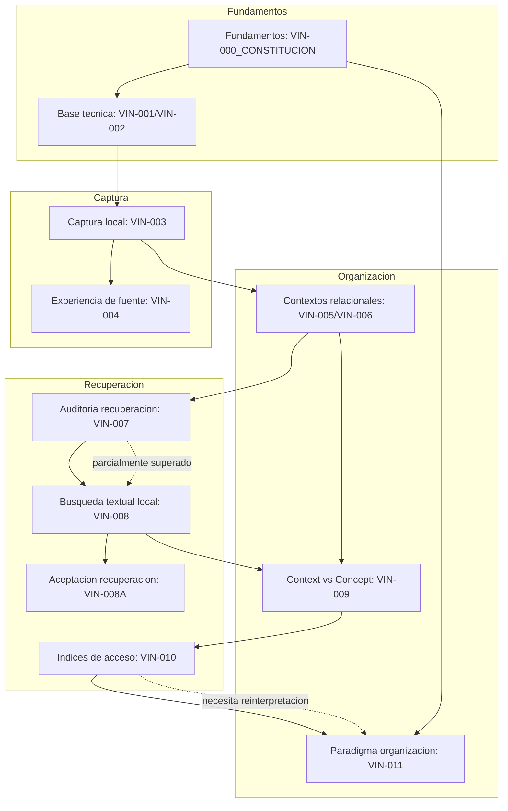

# VIN - Auditoria de alineacion conceptual 000-011

## 1. Resumen ejecutivo

Esta auditoria revisa los documentos VIN reales existentes en el repositorio
entre VIN-000 y VIN-011. El criterio rector usado fue:

```text
Este documento ayuda a resolver como organizar la informacion sin exigir una
ubicacion previa, o como recuperarla posteriormente sin depender de una
jerarquia estatica?
```

Resultado general:

- El eje conceptual vigente esta claramente definido por `VIN-000_CONSTITUCION`,
  VIN-008, VIN-009, VIN-010 y VIN-011.
- La busqueda textual queda reconocida como mecanismo central y excelente de
  recuperacion, no como herramienta inferior.
- `Context` se mantiene como implementacion transitoria y manual de puntos de
  entrada, no como carpeta ni como `Concept` completo.
- Los indices de VIN-010 son utiles como teoria de acceso, pero deben
  reinterpretarse con cuidado para no convertirse en etiquetas o carpetas con
  otro nombre.
- VIN-011 corrige el orden conceptual al separar organizacion y recuperacion:
  guardar primero, asociar despues, recuperar desde multiples caminos.
- Los documentos VIN-001 a VIN-006 son principalmente historicos y tecnicos.
  Siguen siendo utiles para trazabilidad, pero no deben dirigir el modelo de
  producto futuro por si solos.
- Hay documentos VIN-000 auxiliares desactualizados respecto de VIN-008 porque
  todavia afirman que no existe busqueda textual. Deben reinterpretarse o
  corregirse documentalmente.

Conclusion principal:

```text
Vinema esta conceptualmente alineado si se entiende como un sistema que permite
capturar fuentes sin clasificacion previa y recuperarlas despues por busqueda,
asociaciones, contextos, relaciones, cronologia e indices de acceso.
```

La contradiccion mas importante no esta en el codigo ni en una entidad concreta,
sino en el lenguaje heredado: algunos documentos todavia hablan desde "notas",
"contextos" o "busqueda secundaria" de una forma que puede debilitar el eje
actual.

## 2. Inventario de VIN encontrados

### VIN-000

Se encontraron multiples documentos VIN-000:

- `docs/VIN-000-product-constitution.md`
- `docs/VIN-000_CONSTITUCION.md`
- `docs/VIN-000_PUNTO_CERO.md`
- `docs/VIN-000_AUDITORIA_REPOSITORIO.md`
- `docs/VIN-000_AUDITORIA_DOCUMENTAL.md`
- `docs/VIN-000_AUDITORIA_DOMINIO.md`
- `docs/VIN-000_INVENTARIO_FUNCIONAL.md`
- `docs/VIN-000_GLOSARIO.md`
- `docs/VIN-000_DECISIONES_ABIERTAS.md`
- `docs/VIN-000_PLAN_TRANSICION.md`

### VIN-001 a VIN-006

- `docs/VIN-001-domain.md`
- `docs/VIN-002-foundation.md`
- `docs/VIN-003-local-core.md`
- `docs/VIN-004-local-ux.md`
- `docs/VIN-005-contextual-thinking-model.md`
- `docs/VIN-006-context-management.md`

### VIN-007 a VIN-011

- `docs/product/VIN-007-RECOVERY-MODEL-REVIEW.md`
- `docs/product/VIN-008-RECOVERY-BASELINE.md`
- `docs/product/VIN-008A-ACCEPTANCE-REVIEW.md`
- `docs/product/VIN-009-CONTEXT-VS-CONCEPT.md`
- `docs/product/VIN-010-INDICES-DE-ACCESO.md`
- `docs/product/VIN-011-PARADIGMA-ORGANIZACION.md`

### Documentos relacionados no numerados VIN

- `docs/product/VINEMA_ROADMAP.md`

Este documento no se clasifica como VIN-000 a VIN-011, pero funciona como
roadmap rector y se uso como contexto conceptual indirecto cuando correspondia.

## 3. VIN no encontrados

No faltan numeros formales entre VIN-000 y VIN-011. Todos fueron encontrados.

Observacion: VIN-004A y VIN-004B no existen como archivos separados; estan
documentados dentro de `docs/VIN-004-local-ux.md`.

## 4. Eje conceptual vigente

El eje conceptual vigente puede resumirse asi:

```text
Fuente capturada
  ↓
Persistencia sin ubicacion obligatoria
  ↓
Asociaciones e indices posteriores
  ↓
Recuperacion por busqueda, contexto, relaciones, tiempo y otros caminos
```

Principios derivados:

- El usuario no debe decidir hoy como querra recuperar manana.
- La captura debe funcionar sin carpeta, categoria, contexto, etiqueta,
  concepto o indice explicito.
- La busqueda textual es central porque rescata fuentes aun cuando no existe
  organizacion posterior.
- Los contextos, conceptos, indices y asociaciones no son ubicaciones fisicas.
- La organizacion puede evolucionar sin mover ni duplicar fuentes.
- La IA no pertenece al nucleo. Puede sugerir o acelerar, pero no crear verdad.

## 5. Tabla general de evaluacion

| VIN | Archivo real | Pregunta principal | Organizacion | Recuperacion | Estado | Problema principal | Accion recomendada |
| --- | --- | --- | --- | --- | --- | --- | --- |
| VIN-000 | `docs/VIN-000_CONSTITUCION.md` | Que es Vinema y que principios no debe romper? | Si | Si | ALINEADO | Requiere coexistir con constitucion anterior | Mantener como rector |
| VIN-000 | `docs/VIN-000-product-constitution.md` | Cual era la constitucion inicial del producto? | Si | Parcial | NECESITA REINTERPRETACION | Presenta busqueda como secundaria | Mantener historico, corregir rol de busqueda si se consolida |
| VIN-000 | `docs/VIN-000_PUNTO_CERO.md` | Desde que linea base continua Vinema? | Si | Si | ALINEADO | Debe mantenerse actualizado tras VIN-011 | Mantener |
| VIN-000 | `docs/VIN-000_AUDITORIA_REPOSITORIO.md` | Que implementa realmente el repo? | Parcial | Parcial | SUPERADO POR DECISIONES POSTERIORES | Dice que no hay busqueda textual | Corregir o marcar como pre-VIN-008 |
| VIN-000 | `docs/VIN-000_AUDITORIA_DOCUMENTAL.md` | Que docs son rectores o historicos? | Parcial | Parcial | ALINEADO CON OBSERVACIONES | No incluye VIN-010/VIN-011 | Actualizar posteriormente |
| VIN-000 | `docs/VIN-000_AUDITORIA_DOMINIO.md` | Como encaja el dominio actual con Fuente/Concepto/Relacion? | Si | Si | SUPERADO POR DECISIONES POSTERIORES | Afirma que falta busqueda | Corregir o marcar pre-VIN-008 |
| VIN-000 | `docs/VIN-000_INVENTARIO_FUNCIONAL.md` | Que funcionalidades existen y como se alinean? | Si | Si | ALINEADO CON OBSERVACIONES | Puede quedar incompleto tras nuevos docs | Mantener actualizado |
| VIN-000 | `docs/VIN-000_GLOSARIO.md` | Que terminos usa Vinema? | Si | Si | ALINEADO | Contexto como reemplazo posible necesita matiz tras VIN-009 | Mantener, ajustar lenguaje de indices/asociaciones |
| VIN-000 | `docs/VIN-000_DECISIONES_ABIERTAS.md` | Que decisiones no deben cerrarse prematuramente? | Si | Si | ALINEADO | Algunos momentos sugeridos ya ocurrieron | Actualizar despues de auditoria |
| VIN-000 | `docs/VIN-000_PLAN_TRANSICION.md` | Como avanzar sin reescribir? | Si | Si | ALINEADO CON OBSERVACIONES | Paso 3 no incorpora VIN-010/VIN-011 | Mantener y extender |
| VIN-001 | `docs/VIN-001-domain.md` | Cual es el dominio inicial minimo? | Parcial | Ninguna | ALINEADO CON OBSERVACIONES | Define Vinema como app de notas/conocimiento | Mantener historico |
| VIN-002 | `docs/VIN-002-foundation.md` | Que fundacion tecnica habilita local/offline? | Ninguna | Ninguna | ALINEADO | No aborda paradigma conceptual | Mantener tecnico |
| VIN-003 | `docs/VIN-003-local-core.md` | Como capturar, editar y persistir localmente? | Parcial | Parcial | ALINEADO CON OBSERVACIONES | `ORGANIZED` puede sonar a clasificacion aunque no exige carpeta | Mantener historico |
| VIN-004 | `docs/VIN-004-local-ux.md` | Como reducir friccion y perdida en el editor? | Ninguna | Parcial | ALINEADO | No aborda organizacion | Mantener |
| VIN-005 | `docs/VIN-005-contextual-thinking-model.md` | Como relacionar notas con contextos sin duplicar? | Si | Parcial | ALINEADO CON OBSERVACIONES | ContextType cerrado puede volverse taxonomia | Mantener, no expandir tipos |
| VIN-006 | `docs/VIN-006-context-management.md` | Como gestionar Areas/Proyectos/Personas minimamente? | Si | Parcial | NECESITA REINTERPRETACION | UI de contextos puede parecer barra lateral de categorias | Mantener como transicion, no como nucleo futuro |
| VIN-007 | `docs/product/VIN-007-RECOVERY-MODEL-REVIEW.md` | Que falta para recuperar desde pistas incompletas? | Parcial | Si | SUPERADO POR DECISIONES POSTERIORES | Diagnostica falta de busqueda ya resuelta por VIN-008 | Mantener historico |
| VIN-008 | `docs/product/VIN-008-RECOVERY-BASELINE.md` | Como implementar primera recuperacion textual local? | No | Si | ALINEADO | Puede mezclar contexto como campo de busqueda, pero no como ubicacion | Mantener |
| VIN-008A | `docs/product/VIN-008A-ACCEPTANCE-REVIEW.md` | La recuperacion local cumple definicion de terminado? | Parcial | Si | ALINEADO CON OBSERVACIONES | Criterios son funcionales, poco conectados a pruebas de esfuerzo cognitivo | Mantener y complementar con pruebas de producto |
| VIN-009 | `docs/product/VIN-009-CONTEXT-VS-CONCEPT.md` | Context es realmente Concept? | Si | Si | ALINEADO | Puede dejar `Concept` como horizonte demasiado abstracto | Mantener |
| VIN-010 | `docs/product/VIN-010-INDICES-DE-ACCESO.md` | Como convertir fuentes en caminos de acceso? | Mezcla | Si | NECESITA REINTERPRETACION | Riesgo de que indice parezca etiqueta/filtro si se implementa literalmente | Mantener como teoria de recuperacion, no de almacenamiento |
| VIN-011 | `docs/product/VIN-011-PARADIGMA-ORGANIZACION.md` | Como organizar sin ubicacion permanente? | Si | Si | ALINEADO | Aun debe traducirse a criterios de UI | Mantener como eje de organizacion |

## 6. Analisis detallado de cada VIN

### VIN-000 - Constituciones y Punto Cero

Archivos principales:

- `docs/VIN-000_CONSTITUCION.md`
- `docs/VIN-000-product-constitution.md`
- `docs/VIN-000_PUNTO_CERO.md`

Pregunta principal:

- Que es Vinema, que no es y que principios deben protegerse?

Decision o hipotesis central:

- Vinema no es gestor de notas ni sistema de carpetas. Es un motor de acceso al
  conocimiento o una extension de memoria.

Conceptos introducidos:

- fuente;
- memoria navegable;
- conceptos;
- relaciones;
- contexto;
- local-first/offline-first;
- menor carga cognitiva.

Dependencias:

- VIN-001 a VIN-006 implementan parte tecnica anterior.
- VIN-007 a VIN-011 reinterpretan y afinan el eje conceptual.

Organizacion y recuperacion:

- Aborda ambas. La constitucion nueva esta mejor alineada que la constitucion
  anterior.

Busqueda textual:

- `docs/VIN-000-product-constitution.md` dice que la busqueda "no es la
  funcionalidad principal" y la considera secundaria. Esa frase necesita
  reinterpretacion: la busqueda no es el unico paradigma, pero si es central y
  excelente como primer mecanismo de recuperacion.
- `docs/VIN-000_CONSTITUCION.md` no minimiza busqueda textual; habla de acceso
  desde palabra parcial, concepto, relacion o contexto.

IA:

- No se introduce como nucleo. Correcto.

Clasificacion final:

- `VIN-000_CONSTITUCION`: ALINEADO.
- `VIN-000-product-constitution`: NECESITA REINTERPRETACION.
- Punto Cero: ALINEADO.

### VIN-000 - Auditorias, inventario, glosario y plan

Archivos principales:

- `docs/VIN-000_AUDITORIA_REPOSITORIO.md`
- `docs/VIN-000_AUDITORIA_DOCUMENTAL.md`
- `docs/VIN-000_AUDITORIA_DOMINIO.md`
- `docs/VIN-000_INVENTARIO_FUNCIONAL.md`
- `docs/VIN-000_GLOSARIO.md`
- `docs/VIN-000_DECISIONES_ABIERTAS.md`
- `docs/VIN-000_PLAN_TRANSICION.md`

Pregunta principal:

- Que existe realmente, que debe conservarse y que debe evolucionar?

Decision o hipotesis central:

- No reescribir; usar `Node`, `Context` y `NodeContextRelation` como base
  transitoria mientras se valida recuperacion.

Conceptos introducidos:

- Fuente textual;
- Captura;
- Concepto;
- Relacion;
- Contexto como termino de transicion;
- plan incremental.

Dependencias:

- Dependen de VIN-005/VIN-006 para el modelo de contexto.
- Fueron parcialmente superados por VIN-008 en la parte que afirmaba ausencia de
  busqueda.

Organizacion y recuperacion:

- Abordan ambas, con foco en auditoria del estado actual.

Busqueda textual:

- `VIN-000_AUDITORIA_REPOSITORIO` y `VIN-000_AUDITORIA_DOMINIO` todavia dicen
  que no hay busqueda textual. Esto fue correcto antes de VIN-008, pero ahora es
  historico/desactualizado.

IA:

- Se mantiene fuera del nucleo. Correcto.

Clasificacion final:

- ALINEADO CON OBSERVACIONES para documentos de plan/glosario/inventario.
- SUPERADO POR DECISIONES POSTERIORES para auditorias que afirman que no existe
  busqueda.

### VIN-001 - Dominio inicial

Archivo:

- `docs/VIN-001-domain.md`

Pregunta principal:

- Cual es el dominio inicial minimo de Vinema?

Decision central:

- `Node` representa elementos de conocimiento y `Device` representa la
  instalacion local.

Conceptos:

- Node;
- NOTE;
- IDEA;
- Device;
- local-first/offline-first.

Dependencias:

- Prepara VIN-003 y la persistencia local.

Organizacion/recuperacion:

- No resuelve organizacion ni recuperacion actual. Es fundacional.

Busqueda textual:

- No la trata.

IA:

- No aparece.

Alineacion:

- No obliga a elegir ubicacion, pero llama a Vinema "aplicacion personal de
  conocimiento y notas", lenguaje mas estrecho que el actual.

Estado:

- ALINEADO CON OBSERVACIONES.

### VIN-002 - Fundacion tecnica

Archivo:

- `docs/VIN-002-foundation.md`

Pregunta principal:

- Que base tecnica permite Vinema web/PWA/Tauri local?

Decision central:

- Next.js static export, IndexedDB, PWA y Tauri como base local/offline.

Conceptos:

- IndexedDB;
- localStorage fallback;
- PWA;
- Tauri;
- local/offline.

Dependencias:

- Habilita todos los VIN posteriores.

Organizacion/recuperacion:

- Ninguna conceptual; soporte tecnico.

Busqueda textual:

- No la trata.

IA:

- No aparece.

Estado:

- ALINEADO.

### VIN-003 - Nucleo funcional local

Archivo:

- `docs/VIN-003-local-core.md`

Pregunta principal:

- Como capturar ideas, crear notas, editarlas, abrirlas, archivarlas y persistir
  localmente?

Decision central:

- `Node` es modelo interno de conocimiento. `IDEA` e `INBOX` permiten capturar
  sin clasificacion final.

Conceptos:

- Node;
- IDEA;
- NOTE;
- INBOX;
- ORGANIZED;
- ARCHIVED;
- Workspace;
- ruta estatica de detalle.

Dependencias:

- Depende de VIN-001/VIN-002.
- Es base para VIN-004, VIN-005 y VIN-008.

Organizacion/recuperacion:

- Organizacion: parcial, mediante Inbox/Organized/Archive como estados.
- Recuperacion: parcial, listados y apertura.

Busqueda textual:

- La declara fuera de alcance. Correcto para su momento.

IA:

- Fuera de alcance.

Alineacion:

- Alineado porque permite capturar sin contexto o carpeta. Observacion: el
  termino `ORGANIZED` puede sugerir clasificacion, aunque funcionalmente no
  exige ubicacion.

Estado:

- ALINEADO CON OBSERVACIONES.

### VIN-004 - Experiencia local

Archivo:

- `docs/VIN-004-local-ux.md`

Pregunta principal:

- Como reducir perdida y friccion en el detalle de nota?

Decision central:

- Lectura inicial, edicion explicita, autosave controlado, `Listo` y flush al
  volver.

Conceptos:

- modo lectura;
- autosave;
- guardado visible;
- edicion explicita.

Dependencias:

- Depende de VIN-003.

Organizacion/recuperacion:

- No aborda organizacion. Recuperacion solo indirectamente al preservar fuente.

Busqueda textual:

- No la trata.

IA:

- No aparece.

Estado:

- ALINEADO.

### VIN-005 - Contextual Thinking Model

Archivo:

- `docs/VIN-005-contextual-thinking-model.md`

Pregunta principal:

- Como permitir que una nota aparezca desde distintos contextos sin duplicarse?

Decision central:

- Crear `Context`, `ContextType` y `NodeContextRelation` como piezas
  independientes. Las relaciones no viven dentro de `Node`.

Conceptos:

- Context;
- ContextType;
- NodeContextRelation;
- perspectiva;
- relacion muchos-a-muchos.

Dependencias:

- Depende de VIN-003.
- Base de VIN-006 y parcialmente de VIN-008.
- Reinterpretado por VIN-009 y VIN-011.

Organizacion/recuperacion:

- Ambas, aunque con mayor foco en organizacion contextual.

Busqueda textual:

- No la trata.

IA:

- No aparece.

Alineacion:

- Alineado en no duplicar y no crear carpetas. Observacion importante:
  `ContextType` cerrado a Area/Proyecto/Persona puede convertirse en taxonomia
  si se expande sin criterio.

Estado:

- ALINEADO CON OBSERVACIONES.

### VIN-006 - Gestion minima de contextos

Archivo:

- `docs/VIN-006-context-management.md`

Pregunta principal:

- Como gestionar Areas, Proyectos y Personas y relacionarlas con notas desde la
  UI?

Decision central:

- Contextos son formas de recordar y consultar informacion, no ubicaciones.

Conceptos:

- areas;
- proyectos;
- personas;
- detalle de contexto;
- notas relacionadas;
- archivado de contexto.

Dependencias:

- Depende de VIN-005.
- Reinterpretado por VIN-007, VIN-009, VIN-010 y VIN-011.

Organizacion/recuperacion:

- Ambas. Organizacion manual por contexto; recuperacion por contexto.

Busqueda textual:

- No incluida.

IA:

- Excluida.

Alineacion:

- No crea carpetas ni jerarquias, pero la UI de areas/proyectos/personas puede
  funcionar psicologicamente como barra lateral de categorias si no se subordina
  a recuperacion. Debe leerse como transicion, no como paradigma definitivo.

Estado:

- NECESITA REINTERPRETACION.

### VIN-007 - Revision del modelo de recuperacion

Archivo:

- `docs/product/VIN-007-RECOVERY-MODEL-REVIEW.md`

Pregunta principal:

- Que falta para recuperar desde pistas incompletas?

Decision central:

- No reescribir; mantener `Node`, `Context` y `NodeContextRelation`; priorizar
  busqueda local confiable.

Conceptos:

- fuente original;
- recuperacion;
- pistas incompletas;
- busqueda textual;
- contexto como punto de entrada.

Dependencias:

- Depende de VIN-005/VIN-006.
- Directamente lleva a VIN-008.

Organizacion/recuperacion:

- Recuperacion principalmente. Organizacion aparece como riesgo de contextos.

Busqueda textual:

- La trata correctamente como prioridad inmediata. Sin embargo, partes del
  documento estan superadas porque dicen que no existe busqueda textual.

IA:

- No la introduce.

Estado:

- SUPERADO POR DECISIONES POSTERIORES.

### VIN-008 - Linea base de recuperacion local

Archivo:

- `docs/product/VIN-008-RECOVERY-BASELINE.md`

Pregunta principal:

- Como recuperar fuentes por texto y contextos existentes sin red ni cambios de
  esquema?

Decision central:

- Implementar busqueda textual local por titulo, contenido y contextos
  asociados.

Conceptos:

- busqueda local;
- resultado de recuperacion;
- matchedFields;
- excerpt;
- score;
- returnTo;
- fuente visible.

Dependencias:

- Depende de VIN-003, VIN-005, VIN-006 y VIN-007.
- Es aceptado por VIN-008A.

Organizacion/recuperacion:

- Recuperacion. No define organizacion nueva.

Busqueda textual:

- Correcta. La presenta como primera base confiable, no como mecanismo inferior.

Indices:

- No otorga rol excesivo a indices; los indices vectoriales quedan fuera de
  alcance.

IA:

- Fuera de alcance.

Estado:

- ALINEADO.

### VIN-008A - Revision de aceptacion

Archivo:

- `docs/product/VIN-008A-ACCEPTANCE-REVIEW.md`

Pregunta principal:

- VIN-008 cumple su definicion de terminado?

Decision central:

- ACEPTADO CON PENDIENTES NO BLOQUEANTES.

Conceptos:

- criterios de aceptacion;
- navegacion por contexto;
- returnTo seguro;
- compatibilidad offline tecnica;
- validacion manual pendiente.

Dependencias:

- Depende de VIN-008.

Organizacion/recuperacion:

- Recuperacion, con algo de navegacion contextual.

Busqueda textual:

- Validada correctamente.

Indices:

- No aparecen como centro.

IA:

- No aparece.

Alineacion:

- Alineado. Observacion: sus criterios son funcionales y tecnicos; no prueban
  todavia reduccion real de esfuerzo cognitivo.

Estado:

- ALINEADO CON OBSERVACIONES.

### VIN-009 - Context vs Concept

Archivo:

- `docs/product/VIN-009-CONTEXT-VS-CONCEPT.md`

Pregunta principal:

- `Context` representa realmente un `Concept`?

Decision central:

- No completamente. `Context` es punto de entrada contextual manual y limitado;
  `Concept` es una abstraccion futura mas amplia.

Conceptos:

- Fuente;
- Captura;
- Contenido;
- Context;
- Concepto;
- Relacion;
- Memoria;
- Acceder;
- Navegar.

Dependencias:

- Depende de VIN-000, VIN-005, VIN-006, VIN-008.
- Prepara VIN-010 y VIN-011.

Organizacion/recuperacion:

- Ambas.

Busqueda textual:

- No la minimiza. La considera puerta inicial, no modelo completo.

Indices:

- Todavia no central.

IA:

- No se introduce.

Estado:

- ALINEADO.

### VIN-010 - Indices de acceso

Archivo:

- `docs/product/VIN-010-INDICES-DE-ACCESO.md`

Pregunta principal:

- Como convierte Vinema una fuente en multiples caminos de acceso?

Decision central:

- Un indice es un camino de acceso, no fuente, etiqueta, categoria ni
  conocimiento final.

Conceptos:

- Indice;
- familias de indices;
- ciclo de vida;
- fusion/division;
- busqueda textual;
- relaciones;
- IA opcional.

Dependencias:

- Depende de VIN-009.
- Conceptualmente depende de VIN-008 y prepara VIN-011.

Organizacion/recuperacion:

- Mezcla capas: habla de caminos de recuperacion, pero tambien de nacimiento y
  vida de indices, que podria ser leido como organizacion.

Busqueda textual:

- Compatible: afirma que busqueda textual, indices y relaciones conviven.

Indices:

- Riesgo alto de centralidad excesiva si se implementa literalmente. El propio
  documento advierte que indices no son conocimiento ni etiqueta, pero lista
  muchas familias que podrian convertirse en filtros/categorias.

IA:

- Correctamente opcional; no pertenece al nucleo.

Alineacion:

- Util como teoria de recuperacion. Necesita reinterpretacion para mantener
  claro que indice no es almacenamiento ni carpeta.

Estado:

- NECESITA REINTERPRETACION.

### VIN-011 - Paradigma de organizacion

Archivo:

- `docs/product/VIN-011-PARADIGMA-ORGANIZACION.md`

Pregunta principal:

- Como organizar sin exigir ubicacion permanente antes de guardar?

Decision central:

- Guardar primero; asociar despues; recuperar desde multiples caminos.

Conceptos:

- organizacion invisible;
- asociacion;
- fuente sin clasificacion;
- contraejemplos de carpetas;
- riesgos de bandeja infinita.

Dependencias:

- Depende de VIN-010, VIN-009 y VIN-000.
- Reinterpreta VIN-005/VIN-006 como asociaciones, no carpetas.

Organizacion/recuperacion:

- Ambas, separadas en etapas.

Busqueda textual:

- Correcta: indispensable, especialmente para fuentes sin asociaciones.

Indices:

- Subordinados a asociaciones utiles y recuperacion, no presentados como unico
  mecanismo.

IA:

- No delega organizacion a IA.

Estado:

- ALINEADO.

## 7. Mapa de dependencias conceptuales



Lectura del mapa:

- VIN-003 y VIN-004 hacen posible preservar fuentes.
- VIN-005/VIN-006 introducen relacion contextual, pero no deben convertirse en
  nucleo taxonomico.
- VIN-008 corrige la ausencia de busqueda textual.
- VIN-009 evita renombrar `Context` prematuramente.
- VIN-010 explica caminos de acceso, pero puede mezclar organizacion y
  recuperacion.
- VIN-011 ordena el paradigma: guardar, asociar, recuperar.

## 8. Contradicciones detectadas

1. `docs/VIN-000-product-constitution.md` minimiza la busqueda textual como
   mecanismo secundario. Esto contradice la instruccion actual de tratarla como
   central y excelente.
2. `docs/VIN-000_AUDITORIA_REPOSITORIO.md`, `docs/VIN-000_AUDITORIA_DOMINIO.md`
   y partes de VIN-007 dicen que no hay busqueda textual. Eso fue cierto en su
   momento, pero esta superado por VIN-008.
3. VIN-006 puede inducir a leer Areas/Proyectos/Personas como barra lateral de
   organizacion manual, aunque el texto diga que no son carpetas.
4. VIN-010 puede ser malinterpretado como una propuesta de muchas categorias de
   indices. El documento lo niega, pero el riesgo existe por la amplitud de
   familias listadas.
5. La palabra `ORGANIZED` en VIN-003 puede sugerir organizacion previa, aunque
   en el comportamiento real solo separa Inbox de nota.

## 9. Solapamientos detectados

- VIN-000_CONSTITUCION, VIN-009, VIN-010 y VIN-011 definen Fuente desde angulos
  parecidos.
- VIN-005, VIN-006 y VIN-009 cubren Context como punto de entrada.
- VIN-007, VIN-008 y VIN-008A cubren recuperacion local y busqueda textual.
- VIN-010 y VIN-011 se solapan en "caminos posteriores a la captura"; VIN-010
  habla desde recuperacion, VIN-011 desde organizacion.
- VIN-000_AUDITORIA_DOCUMENTAL y esta auditoria tienen propositos similares,
  pero esta incorpora VIN-008 a VIN-011.

## 10. Conceptos prematuros

- `Concept` como entidad persistida: VIN-009 recomienda no implementarlo aun.
- Familias universales de indices: VIN-010 las investiga, pero no deben
  convertirse en tipos del MVP automaticamente.
- Relaciones concepto-concepto: utiles a futuro, prematuras ahora.
- IA para sugerir indices o relaciones: posible acelerador futuro, no nucleo.
- Grafo visible: repetidamente excluido o pospuesto.
- Fuente/Captura separadas como entidades: aun abierto.
- Documento/PDF como fuente formal: aparece en VIN-011 como caso futuro, fuera
  del MVP actual.

## 11. Conceptos que funcionan como filtros con otro nombre

- `ContextType` (`AREA`, `PROJECT`, `PERSON`) funciona hoy como faceta/filtro de
  contextos. Es aceptable si se reconoce como faceta manual, no como paradigma
  completo.
- Listados `/contexts/areas`, `/contexts/projects`, `/contexts/people`
  funcionan como agrupaciones por tipo. No son carpetas porque no contienen la
  fuente, pero pueden sentirse como barra lateral clasificatoria.
- `matchedFields` en VIN-008 es una explicacion/faceta de coincidencia, no
  camino de navegacion profundo.
- Familias de indices de VIN-010 pueden ser filtros si solo seleccionan
  resultados. Se vuelven caminos de navegacion solo si permiten abrir fuentes,
  descubrir nuevos indices, preservar origen y explicar relaciones.
- `INBOX`, `ARCHIVED` y potencial `Diario` son perspectivas derivadas. Son
  facetas de estado/tiempo, no carpetas.

La existencia de filtros no es un problema. El problema seria presentarlos como
un paradigma nuevo si la experiencia se limita a "filtrar listas".

## 12. Resultado de las siete pruebas transversales

### Prueba 1: Fuente sin clasificacion

Caso:

```text
Titulo: Mitcom
Contenido: Mitcom
Sin carpeta, etiqueta, contexto, concepto, asociacion ni indice explicito.
```

Respuesta segun documentos vigentes:

- VIN-003 permite crear la fuente sin contexto.
- VIN-008 permite recuperarla mediante busqueda textual por titulo o contenido.
- VIN-011 confirma que una fuente puede existir sin asociaciones explicitas.

Resultado: PASA.

Contradiccion residual: la constitucion anterior puede leerse como si la
busqueda fuera secundaria. Debe reinterpretarse.

### Prueba 2: Nota con multiples sentidos

Caso:

- Mitcom;
- Nogales;
- pruebas;
- retraso;
- decision operacional.

Respuesta:

- VIN-005/VIN-006 permiten multiples contextos sin duplicar fuente, pero solo si
  encajan en Area/Proyecto/Persona.
- VIN-008 permite recuperar por texto aunque no existan relaciones.
- VIN-010/VIN-011 explican multiples indices/asociaciones futuras.

Resultado: PASA CON OBSERVACIONES.

Observacion: el modelo actual no representa Nogales, problema, decision o
pruebas como tipos propios. No debe forzarse agregando tipos prematuros.

### Prueba 3: Cambio de interpretacion

Caso:

Una nota inicialmente relevante por proveedor luego se vuelve relevante por una
decision contractual.

Respuesta:

- VIN-005/VIN-006 permiten agregar/quitar relaciones sin mover ni duplicar la
  nota.
- VIN-011 afirma que la organizacion puede evolucionar despues del
  almacenamiento.
- VIN-010 permite fusion/division/evolucion conceptual de indices.

Resultado: PASA.

Limitacion: no existe todavia una entidad `Decision` ni relacion con significado.

### Prueba 4: Barra lateral

Respuesta:

- VIN-006 agrega rutas laterales por Areas/Proyectos/Personas.
- Documentalmente se insiste en que no son carpetas.
- A nivel experiencia, esas rutas pueden funcionar como barra lateral
  clasificatoria si se convierten en entrada dominante.

Resultado: PASA CON RIESGO.

Concepto que puede funcionar como carpeta disfrazada: `Context` si se exige o si
la navegacion principal se centra en Areas/Proyectos/Personas por encima de
buscar y recuperar.

### Prueba 5: Recuperacion incompleta

Pistas:

- persona;
- lugar;
- fecha aproximada;
- palabra parcial.

Mecanismos contemplados:

- Persona: Context actual `PERSON`, si fue creado/asociado.
- Lugar: conceptual en VIN-009/VIN-010/VIN-011, no implementado.
- Fecha aproximada: conceptual en VIN-010/VIN-011, metadata existe pero no vista
  ni busqueda temporal.
- Palabra parcial: VIN-008 cubre busqueda textual local por titulo/contenido.

Resultado: PASA PARCIALMENTE.

### Prueba 6: Filtros con otro nombre

Clasificacion:

- Filtros/facetas: `ContextType`, estado `INBOX/ARCHIVED`, `matchedFields`,
  potencial fecha.
- Etiquetas potenciales: familias de indices si se implementan como marcadores
  planos.
- Relaciones: `NodeContextRelation`, futuras relaciones con evidencia.
- Agrupaciones: vistas de Areas/Proyectos/Personas.
- Caminos reales de navegacion: busqueda -> fuente; busqueda -> contexto ->
  fuente; fuente -> contexto -> fuentes relacionadas.

Resultado: PASA CON OBSERVACIONES.

No todo lo llamado indice o contexto es automaticamente un paradigma nuevo. Debe
demostrar diferencia de experiencia.

### Prueba 7: Dependencia de IA

Simulacion:

Toda IA desaparece.

Resultado:

- VIN-002 a VIN-008 siguen funcionando.
- VIN-009 a VIN-011 siguen siendo teorias validas.
- IA aparece solo como posible acelerador futuro en VIN-010.

Resultado: PASA.

No hay dependencia critica de IA.

## 13. Clasificacion final de cada VIN

| VIN | Estado final |
| --- | --- |
| VIN-000_CONSTITUCION | ALINEADO |
| VIN-000-product-constitution | NECESITA REINTERPRETACION |
| VIN-000_PUNTO_CERO | ALINEADO |
| VIN-000_AUDITORIA_REPOSITORIO | SUPERADO POR DECISIONES POSTERIORES |
| VIN-000_AUDITORIA_DOCUMENTAL | ALINEADO CON OBSERVACIONES |
| VIN-000_AUDITORIA_DOMINIO | SUPERADO POR DECISIONES POSTERIORES |
| VIN-000_INVENTARIO_FUNCIONAL | ALINEADO CON OBSERVACIONES |
| VIN-000_GLOSARIO | ALINEADO |
| VIN-000_DECISIONES_ABIERTAS | ALINEADO |
| VIN-000_PLAN_TRANSICION | ALINEADO CON OBSERVACIONES |
| VIN-001 | ALINEADO CON OBSERVACIONES |
| VIN-002 | ALINEADO |
| VIN-003 | ALINEADO CON OBSERVACIONES |
| VIN-004 | ALINEADO |
| VIN-005 | ALINEADO CON OBSERVACIONES |
| VIN-006 | NECESITA REINTERPRETACION |
| VIN-007 | SUPERADO POR DECISIONES POSTERIORES |
| VIN-008 | ALINEADO |
| VIN-008A | ALINEADO CON OBSERVACIONES |
| VIN-009 | ALINEADO |
| VIN-010 | NECESITA REINTERPRETACION |
| VIN-011 | ALINEADO |

## 14. Recomendaciones

1. Declarar `docs/VIN-000_CONSTITUCION.md` como constitucion vigente y
   `docs/VIN-000-product-constitution.md` como constitucion historica.
2. Corregir o anotar documentos que dicen que no existe busqueda textual.
3. Mantener VIN-008 como base formal de recuperacion textual local.
4. Mantener VIN-011 como eje conceptual de organizacion.
5. Reinterpretar VIN-010 como teoria de recuperacion/caminos, no como lista de
   entidades ni filtros a implementar.
6. Reinterpretar VIN-006 como gestion minima transitoria, no como barra lateral
   definitiva.
7. Evitar agregar `ContextType` nuevos hasta definir asociacion/indice/concepto
   con criterios de utilidad.
8. No minimizar busqueda textual en ningun documento nuevo.
9. Separar explicitamente en futuros documentos: organizacion, recuperacion,
   navegacion, relaciones e IA opcional.
10. Mantener IA fuera del nucleo.

## 15. Orden conceptual recomendado

Orden recomendado:

```text
Fundamentos del producto
  ↓
Fuente y captura
  ↓
Persistencia local/offline
  ↓
Experiencia de captura sin clasificacion
  ↓
Organizacion despues de guardar
  ↓
Asociaciones
  ↓
Recuperacion textual
  ↓
Navegacion contextual
  ↓
Cronologia
  ↓
Indices de acceso
  ↓
Relaciones con significado
  ↓
Conceptos persistidos si se justifican
  ↓
IA opcional
```

Justificacion:

- La organizacion debe definirse antes de ampliar indices o conceptos.
- La busqueda textual debe aparecer temprano porque rescata fuentes sin
  asociaciones.
- Los indices no deben preceder a la comprension de asociaciones.
- `Concept` no debe preceder a una razon clara de acceso.
- IA debe quedar al final como acelerador opcional.

## 16. Documentos que deberian mantenerse, corregirse, reinterpretarse, fusionarse, archivarse o renombrarse

### Mantener

- `docs/VIN-000_CONSTITUCION.md`
- `docs/VIN-000_PUNTO_CERO.md`
- `docs/VIN-002-foundation.md`
- `docs/VIN-003-local-core.md`
- `docs/VIN-004-local-ux.md`
- `docs/VIN-005-contextual-thinking-model.md`
- `docs/product/VIN-008-RECOVERY-BASELINE.md`
- `docs/product/VIN-008A-ACCEPTANCE-REVIEW.md`
- `docs/product/VIN-009-CONTEXT-VS-CONCEPT.md`
- `docs/product/VIN-011-PARADIGMA-ORGANIZACION.md`

### Corregir

- `docs/VIN-000_AUDITORIA_REPOSITORIO.md`: actualizar estado de busqueda.
- `docs/VIN-000_AUDITORIA_DOMINIO.md`: actualizar estado de busqueda.
- `docs/VIN-000_INVENTARIO_FUNCIONAL.md`: extender con VIN-010/VIN-011 si se
  consolida esta auditoria.

### Reinterpretar

- `docs/VIN-000-product-constitution.md`: reinterpretar busqueda como central,
  aunque no sea el unico camino.
- `docs/VIN-006-context-management.md`: contexto como transicion/asociacion, no
  como nucleo de organizacion.
- `docs/product/VIN-010-INDICES-DE-ACCESO.md`: indices como caminos de
  recuperacion, no taxonomia.

### Fusionar o consolidar

- Las auditorias VIN-000 podrian consolidarse en un indice documental posterior.
- VIN-007 podria resumirse dentro de una historia de recuperacion junto a
  VIN-008/VIN-008A.

### Archivar historicamente

- `docs/VIN-001-domain.md` cuando exista una documentacion de dominio vigente.
- `docs/product/VIN-007-RECOVERY-MODEL-REVIEW.md` si se crea una linea historica
  de recuperacion consolidada.

### Renombrar

No renombrar aun. Posibles renombres futuros:

- `Context` hacia otro lenguaje solo despues de decidir `Concept`.
- `VIN-010-INDICES-DE-ACCESO.md` podria aclararse como "Teoria de caminos de
  recuperacion" si el termino indice se vuelve confuso.

## 17. Preguntas abiertas

1. Que documento sera declarado explicitamente como constitucion unica vigente?
2. Como se anotaran documentos historicos sin reescribir su valor de trazabilidad?
3. Debe corregirse la constitucion anterior o solo marcarse como historica?
4. Cual sera la primera experiencia que demuestre "guardar primero, asociar
   despues" mas alla de busqueda textual?
5. Que diferencia visual real habra entre filtro, contexto, asociacion e indice?
6. Cuando una asociacion merece volverse navegable?
7. Como evitar que Areas/Proyectos/Personas dominen la barra lateral como
   carpetas disfrazadas?
8. Como se medira que la busqueda textual no queda degradada frente a otros
   mecanismos?
9. Que rol tendra la cronologia como camino de recuperacion?
10. Como se mostrara una fuente sin asociaciones para que no parezca perdida?
11. Que criterios deben cumplirse antes de introducir `Concept` persistido?
12. Que documentos deben moverse eventualmente a `docs/archive`?
